# Fase 6-7 — Propuesta tecnológica y arquitectura del sistema

> Depende de `05-requisitos-funcionales.md` y `06-requisitos-no-funcionales.md` (Fases 4-5,
> cerradas). El usuario expresó preferencia por **Supabase, bajo su propio control**
> (`00-plan-trabajo.md` §3.6) — se toma como candidato fuerte, pero se compara igual contra 1-2
> alternativas antes de recomendar formalmente (regla del proyecto: no elegir tecnología solo
> por preferencia/popularidad sin justificar el ajuste).

## Parte A — Alternativas tecnológicas

Criterios de comparación, en orden de peso para este proyecto específico: (1) velocidad de
desarrollo para **una sola persona** con **urgencia** (`00-plan-trabajo.md` §3.7), (2) soporte
nativo para **aislamiento entre titulares** (row-level security, requisito crítico de
`06-requisitos-no-funcionales.md`), (3) ajuste al modelo de datos **relacional** (movimientos,
deudas, amortización de la moto — todo con relaciones y sumas, no documentos sueltos), (4) costo
de operación con un solo usuario real, (5) qué tan bien resuelve "tiempo real en el mismo
dispositivo" (`00-plan-trabajo.md` §3.4).

### Alternativa 1 — Supabase (candidato del usuario)

- **Arquitectura**: Postgres administrado + Auth integrado + Realtime (suscripciones vía
  websockets sobre cambios en Postgres) + Storage + Edge Functions (Deno) para lógica de
  servidor.
- **Ventajas**: (a) Postgres es una base relacional real — modela sin fricción movimientos,
  deudas, tabla de amortización de la moto y sus relaciones con titulares; (b) **row-level
  security (RLS) nativo de Postgres** — es la forma más directa de cumplir el requisito de
  aislamiento entre titulares *a nivel de base de datos*, no solo en el código de la app (ver
  `06-requisitos-no-funcionales.md`); (c) Realtime resuelve de fábrica la actualización
  inmediata del dashboard al guardar un movimiento; (d) plan gratuito viable para un usuario
  real; (e) el usuario ya lo tenía en mente y opera bajo su propia cuenta, cumpliendo la
  preferencia de "control propio" sin tener que administrar un servidor.
- **Desventajas**: la lógica de negocio compleja (recálculo de amortización con abonos a
  capital) requiere escribirla en SQL (funciones/triggers) o en Edge Functions — menos habitual
  para un desarrollador que viene de JavaScript/TypeScript puro que escribir esa misma lógica en
  un backend Node tradicional; cierto vendor lock-in de las funciones específicas de Supabase
  (Auth, Realtime) si algún día se quisiera migrar.
- **Costo aproximado**: plan gratuito de Supabase cubre un solo usuario real con holgura
  (límites generosos de filas/almacenamiento a la fecha de este documento — **verificar en el
  sitio oficial antes de asumirlo como definitivo**, los planes cambian con frecuencia).
- **Complejidad para un equipo de una persona**: baja-media — no hay servidor que administrar,
  pero sí que aprender RLS y Edge Functions si no se conocían antes.
- **Riesgos**: depender de un proveedor cerrado para Auth/Realtime; RLS mal escrito da una falsa
  sensación de seguridad (una política incorrecta puede filtrar datos entre titulares
  igual que un filtro de aplicación mal hecho).

### Alternativa 2 — Firebase (Firestore + Auth + Cloud Functions)

- **Arquitectura**: Firestore (NoSQL orientado a documentos) + Auth + Realtime Database/Firestore
  listeners + Cloud Functions.
- **Ventajas**: tiempo real de fábrica igual que Supabase; plan gratuito amplio; muy documentado.
- **Desventajas**: Firestore **no es relacional** — el modelo de este proyecto (movimientos que
  se suman a saldos de cuentas, deudas con pagos asociados, tabla de amortización de la moto con
  recálculo, todo filtrado por titular) encaja mal en documentos NoSQL; construir "joins" y
  agregaciones consistentes (saldo = suma de movimientos) es más trabajoso y propenso a
  inconsistencias que con SQL. Las reglas de seguridad de Firestore (el equivalente a RLS) son
  más difíciles de razonar para un modelo con tantas relaciones cruzadas (titular → cuenta →
  movimiento → categoría).
- **Costo aproximado**: similar a Supabase en el nivel gratuito.
- **Complejidad para un equipo de una persona**: media — la curva de aprendizaje de modelar bien
  en NoSQL para este caso de uso es mayor que aprender RLS en Postgres.
- **Riesgos**: mayor probabilidad de bugs de cálculo de saldo por un modelo de datos que no
  encaja naturalmente con el dominio (finanzas = sumas y relaciones, terreno de SQL).
- **Veredicto**: descartada — el desajuste con un dominio inherentemente relacional pesa más que
  cualquier ventaja de familiaridad.

### Alternativa 3 — Stack propio (Next.js + NestJS/Fastify + PostgreSQL administrado, ej. Neon/Railway)

- **Arquitectura**: frontend Next.js separado de un backend API propio (NestJS o Fastify) sobre
  PostgreSQL administrado por un tercero (Neon, Railway, RDS, etc.), con autenticación propia
  (Auth.js/Lucia) y WebSockets propios (Socket.io) para actualizaciones en tiempo real.
- **Ventajas**: control total de cada capa; sin vendor lock-in de Auth/Realtime; la lógica de
  amortización se escribe en TypeScript, lenguaje más común para un desarrollador full-stack
  que SQL avanzado o Edge Functions en Deno.
- **Desventajas**: **hay que construir y mantener** autenticación, tiempo real y aislamiento
  entre titulares (RLS manual con `WHERE titular_id = ...` en cada query, sin la garantía a
  nivel de base de datos que da Postgres+RLS) — más superficie para el error humano de "olvidar
  el filtro en una consulta", justo el riesgo que `06-requisitos-no-funcionales.md` señala como
  crítico. Mucho más tiempo de construcción — **choca directamente con la urgencia pedida por
  el usuario** (`00-plan-trabajo.md` §3.7).
- **Costo aproximado**: similar en el nivel gratuito/bajo, pero con más piezas separadas que
  mantener (backend propio, base de datos, hosting de cada una).
- **Complejidad para un equipo de una persona**: alta — es la opción con más piezas propias que
  operar y asegurar.
- **Veredicto**: descartada para el MVP por tiempo — queda como alternativa válida si más
  adelante el proyecto crece a un equipo o necesita salir del ecosistema Supabase.

### Recomendación

**[RECOMENDACIÓN]** **Supabase**, confirmando la preferencia del usuario — no por popularidad,
sino porque es la única de las tres que resuelve de fábrica, al mismo tiempo, el requisito más
crítico del proyecto (aislamiento entre titulares vía RLS de Postgres) y el requisito de tiempo
más apremiante (urgencia, sin backend propio que construir). Frontend: **Next.js** (React),
desplegado en un servicio gratuito compatible (Vercel u otro equivalente — a confirmar según
preferencia del usuario, no es una decisión crítica). Notificaciones (Fase 2): correo vía un
proveedor transaccional de plan gratuito (a definir cuando entre en alcance) — no se elige aún
para no comprometer una decisión que no es del MVP.

## Parte B — Arquitectura del sistema

### Diagrama de contexto

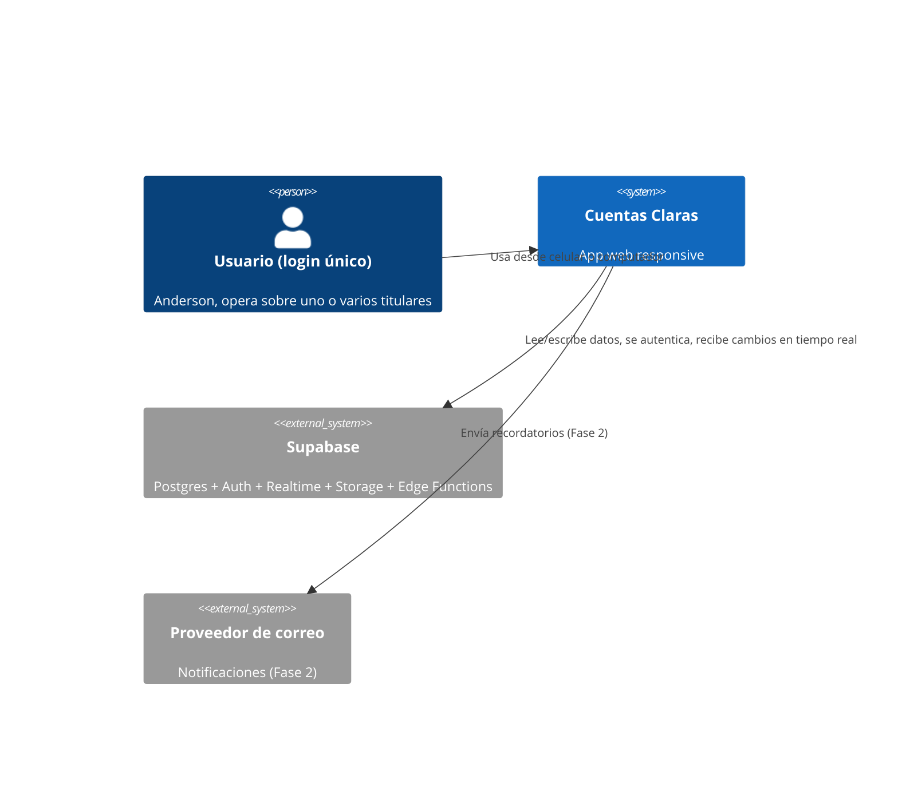

### Diagrama de contenedores

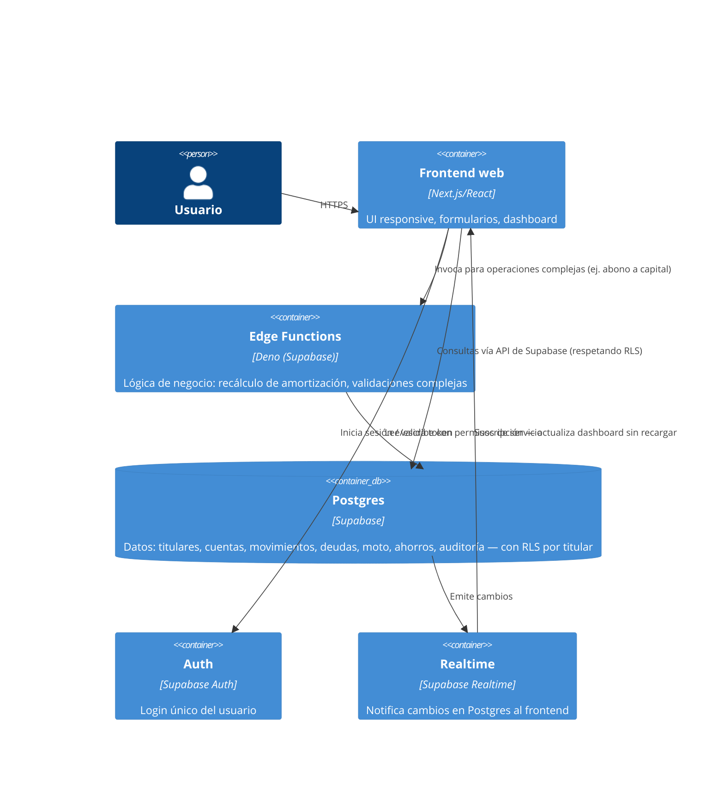

### Diagrama de componentes (frontend)

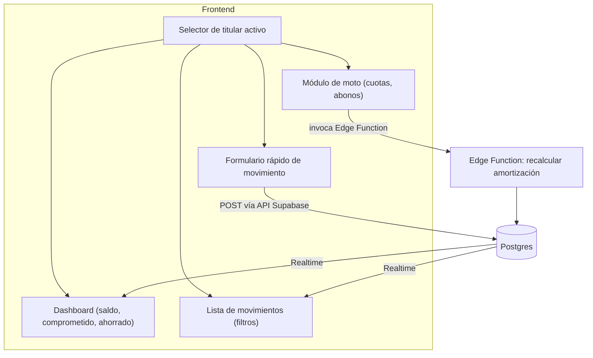

### Flujo de autenticación

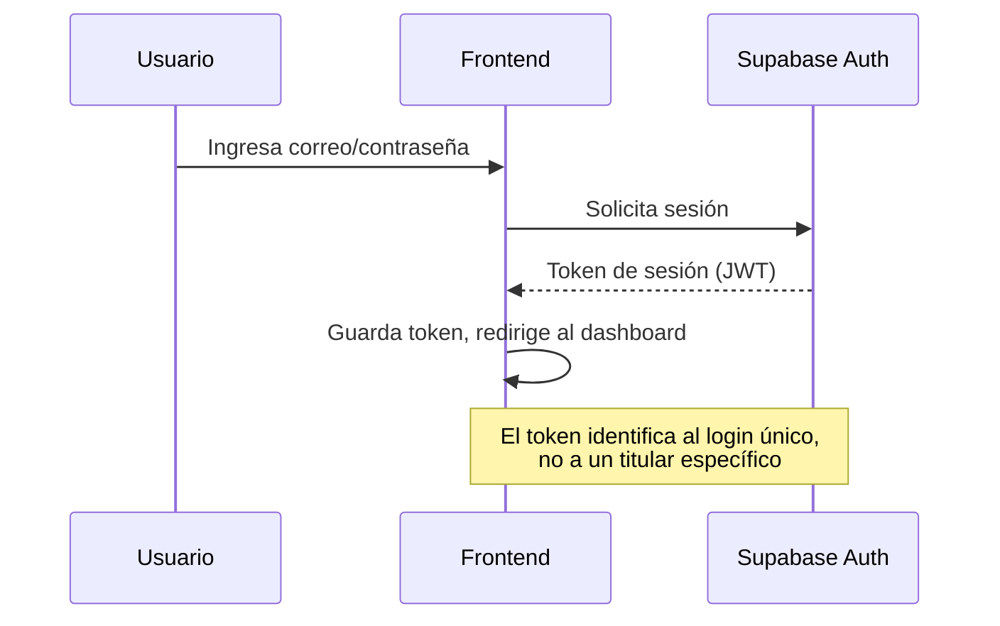

### Flujo de registro de gasto (caso 1 de `04-casos-de-uso.md`)

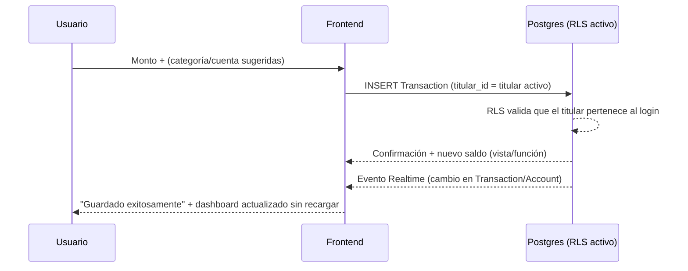

### Flujo de registro de abono a capital de la moto (caso 11b)

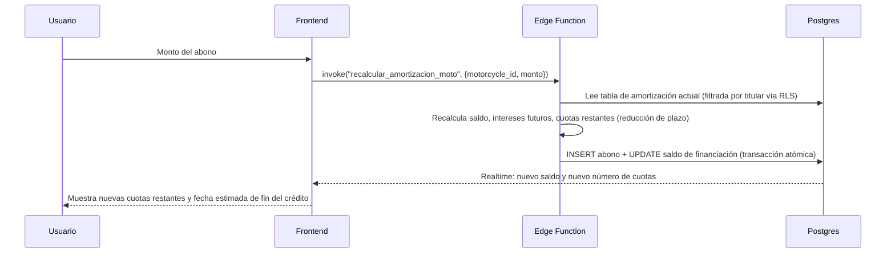

### Flujo de sincronización (mismo dispositivo, ver `11-tiempo-real-sincronizacion.md`)

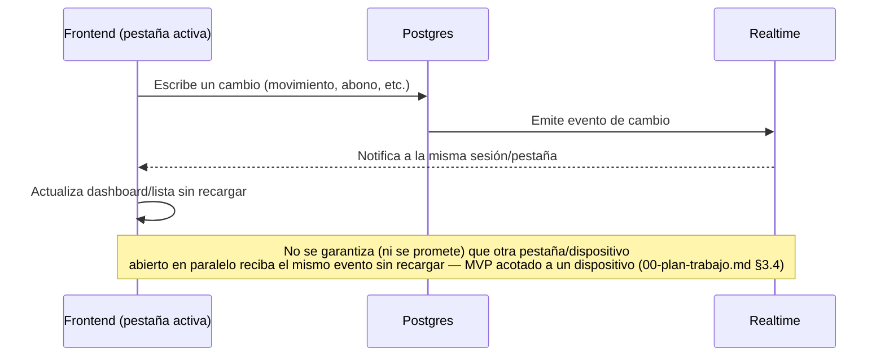

### Flujo de importación del Excel (Fase 2, depende de `10-migracion-excel.md`)

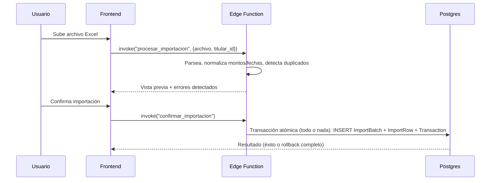

### Flujo de notificaciones (Fase 2)

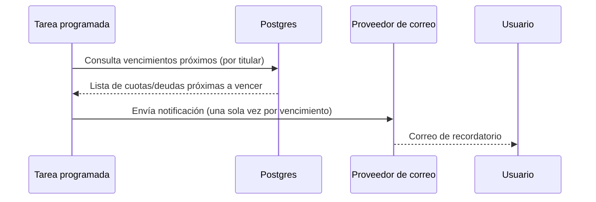

### Flujo de generación de reportes (Fase 2)

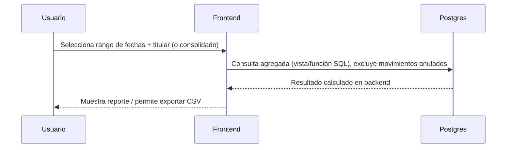

### Flujo de auditoría

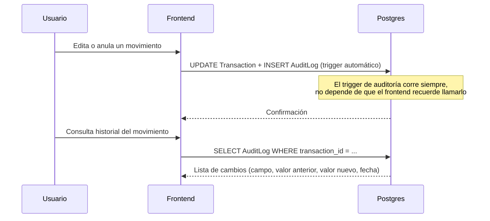

## Principio no negociable: fuente de verdad de los saldos

Los saldos **no se calculan en el frontend**. En esta arquitectura, eso se traduce
concretamente en: toda cifra de saldo (disponible, comprometido, ahorrado, patrimonio neto) se
obtiene de una **vista o función SQL en Postgres** (o de una Edge Function que solo lee/escribe
en la base), nunca de una suma hecha en JavaScript en el navegador con datos ya traídos. El
frontend solo **muestra** lo que la base de datos devuelve. Esto aplica igual **por titular** y
en la vista consolidada — la suma consolidada también se calcula en el backend, no sumando en
el cliente los totales de cada titular.

## Cómo esta arquitectura resuelve el aislamiento entre titulares

Cada tabla con datos financieros (`Account`, `Transaction`, `Debt`, `Loan`, `Motorcycle`,
`SavingsGoal`, etc.) tiene una columna `titular_id`. Una política de **row-level security** en
Postgres (aplicada por defecto a toda consulta, sin que el desarrollador tenga que recordar
agregar un `WHERE` manualmente) exige que `titular_id` pertenezca a un titular del `usuario_id`
autenticado. Esto convierte el requisito de `06-requisitos-no-funcionales.md` ("0 incidentes de
fuga cruzada") en algo verificable a nivel de base de datos, no solo de disciplina en el código
de la aplicación.

## Cierre de esta fase

- **Decisiones tomadas**: Supabase recomendado y confirmado (no solo por preferencia del
  usuario, sino por ajuste real a los criterios de RLS, modelo relacional y urgencia); Next.js
  como frontend; Edge Functions para lógica compleja (amortización, abonos a capital,
  importación); diagramas de arquitectura y de los flujos principales producidos en Mermaid.
- **Supuestos pendientes de confirmar**: los límites exactos del plan gratuito de Supabase
  (cambian con frecuencia — verificar en el sitio oficial antes de comprometerse a operar
  gratis indefinidamente); el proveedor de correo para notificaciones (Fase 2, no se eligió
  aún); dónde se despliega el frontend (Vercel u otro, no es una decisión crítica pendiente).
- **Riesgos detectados**: (1) una política de RLS mal escrita da falsa sensación de seguridad —
  debe probarse explícitamente en `14-plan-pruebas.md` con casos que intenten cruzar titulares;
  (2) la lógica de amortización en Edge Functions (Deno/TypeScript) es menos común que un
  backend Node tradicional — documentar bien esas funciones para que sean mantenibles; (3)
  cierto vendor lock-in de Supabase (Auth, Realtime) — aceptado conscientemente a cambio de
  velocidad, dado el pedido de urgencia del usuario.
- **Entregables generados**: este documento, con la comparación de 3 alternativas y los
  diagramas de arquitectura y flujos pedidos.
- **Próxima etapa recomendada**: `08-modelo-datos.md` (Fase 8) — ya puede detallarse con la
  arquitectura elegida (Postgres/Supabase, RLS por titular) y los 25+1 casos de uso de
  `04-casos-de-uso.md` como insumo directo de qué entidades y campos se necesitan.
